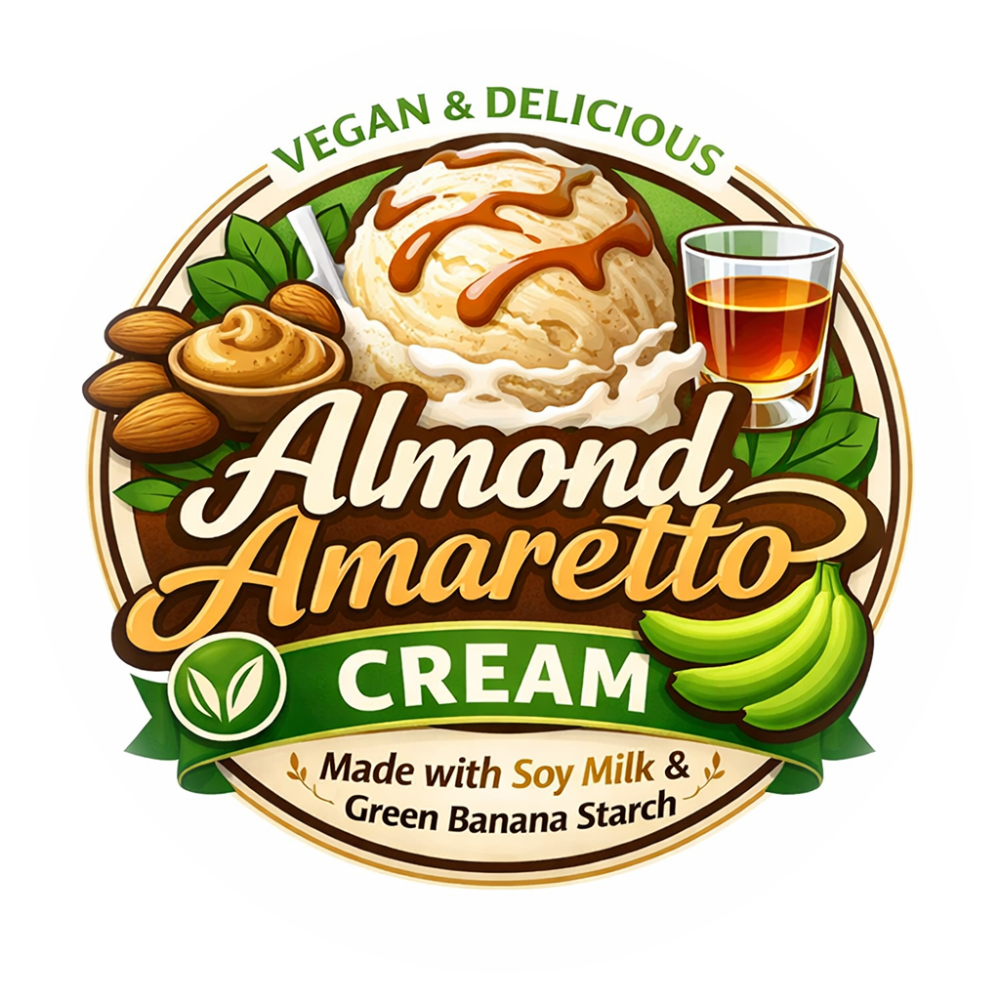

# Vegan Almond (Deluxe)

Vegan base with almond butter and amaretto in soy milk thickened with green banana starch.

Process on *Light Ice Cream*, with scrape-down, and a mix-in or respin run if needed. 

> 
> 
> 

Rating: 😋 (untested)

# INGREDIENTS

ℹ️ Brand names are in square brackets `[...]`.

**Prep**

  - _350ml_ [Soy milk 1.6% (sugar-free) \[Berief\]](/ice-creamery/info/ingredients/#soy-milk){target="_blank"}↗ • *alternative:* any other preferred milk (~2% fat)
  - _40g_ [Almond butter (creamy) \[Seba Garden\]](/ice-creamery/info/ingredients/#almond-milk-butter){target="_blank"}↗

**Wet**

  - _160ml_ [Soy milk 1.6% (sugar-free) \[Berief\]](/ice-creamery/info/ingredients/#soy-milk){target="_blank"}↗ • *alternative:* any other preferred milk (~2% fat)
  - _40ml_ [Amaretto 28 vol%](/ice-creamery/info/ingredients/#alcohol-ethanol){target="_blank"}↗

**Dry**

  - _45g_ [SweEX (Erythritol + Xylitol 3:2)](/ice-creamery/info/ingredients/#sweex-erythritol-xylitol-blend){target="_blank"}↗ • *alternative:* 60g allulose or dextrose
  - _20g_ [Banana Powder (green plantain) \[Govinda\]](/ice-creamery/info/ingredients/#green-banana-powder-plantain){target="_blank"}↗ • About 7% fiber (resistant starch); must be cooked
  - _20g_ [Inulin \[Vit4ever\]](/ice-creamery/info/ingredients/#inulin){target="_blank"}↗ • Sweetness = 8%; GI ~= 0
  - _2g_ [Glycerol Monostearate (E471) \[Bulk\]](/ice-creamery/info/ingredients/#glycerol-monostearate-gms-e471){target="_blank"}↗
  - _2g_ Vanilla Bean Powder [InterVanilla]
  - _1g_ Salt

**Adjust sweetness**

  - _≈3 drops_ Flavor drops Cookies&Cream (stevia) [Nick’s] • to taste

# DIRECTIONS

 1. Heat the soy milk and almond butter to about 90°C, in a saucepan.
 1. Mix the dry ingredients together and whisk them into the hot milk.
 1. Let the milk cool down a bit and blend in the rest of the ‘wet’ ingredients.
 1. For better results, let the base age in the fridge (covered, lid on), for a few hours or over night. This helps flavor development and gum hydration, especially with unheated bases.
 1. Freeze for 24h with lid on, then spin as usual. Flatten any humps before that.
 1. Process with RE-SPIN mode when not creamy enough after the first spin.

# NUTRITIONAL & OTHER INFO

- **Nutritional values per 100g/ml:** 100g; 100.5 kcal; fat 4.3g; carbs 14.8g; sugar 2.6g; protein 3.6g; salt 0.2g
- **Nutritional values per ½ Deluxe Tub:** 340g; 341.7 kcal; fat 14.7g; carbs 50.4g; sugar 8.9g; protein 12.1g; salt 0.7g
- **Nutritional values total:** 680g; 683.4 kcal; fat 29.5g; carbs 100.9g; sugar 17.8g; protein 24.2g; salt 1.5g
- **FPDF / [PAC](/ice-creamery/info/glossary/#potere-anti-congelante-pac){target="_blank"}↗ (target 20..30):** 31.00
- **Protein / Energy Ratio (ok=12%; hi=20%):** 14.14% • Low-Sugar
- **Milk Solids Non-Fat ([MSNF](/ice-creamery/info/glossary/#milk-solids-not-fat-msnf){target="_blank"}↗, 7-11%):** 20.4g • 3.0%
- **Net carbs:** 38.1g • *∝ 5 servings@136g:* 7.6g • *∝ 3 servings@227g:* 12.7g • *energy ratio (low <20%):* 22.3%
