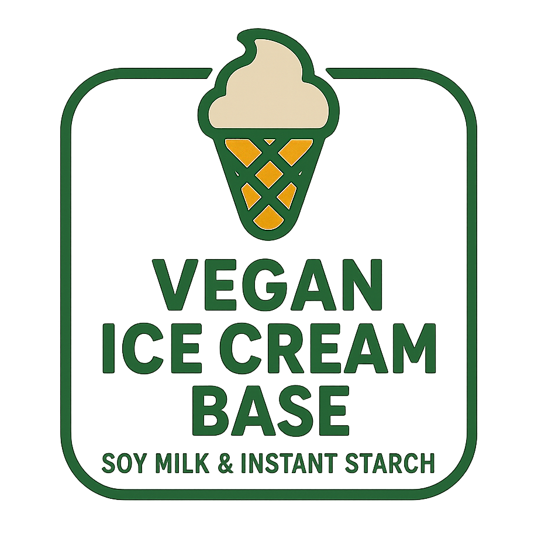

# Vegan Vanilla (Deluxe)

Plain vanilla base using soy milk and instant starch.

Change the vanilla flavoring to what you have, e.g. vanilla paste or essence. Just be sure to use enough, and taste the base.
Or use other flavoring in combination wit the vanilla, or replacing it.

Process on *Light Ice Cream*, with scrape-down, and a mix-in or respin run if needed. 

> 
> 
> 

Rating: 😋 (untested)

# INGREDIENTS

ℹ️ Brand names are in square brackets `[...]`.

**Wet**

  - _550ml_ [Soy milk 1.6% (sugar-free) \[Berief\]](/ice-creamery/info/ingredients/#soy-milk){target="_blank"}↗ • *alternative:* any other preferred milk (~2% fat)
  - _15g_ [Glycerin (E422, VG) \[hd-line\]](/ice-creamery/info/ingredients/#vegetable-glycerin-glycerol-vg-e422){target="_blank"}↗ • Sweetness = 60%; GI = 5; Density = 1.26 g/ml
  - _10g_ [Brandy or Vodka 40 vol%](/ice-creamery/info/ingredients/#alcohol-ethanol){target="_blank"}↗ • *alternative:* 8g (additional) VG for a sober recipe

**Dry**

  - _45g_ [SweEX (Erythritol + Xylitol 3:2)](/ice-creamery/info/ingredients/#sweex-erythritol-xylitol-blend){target="_blank"}↗ • *alternative:* 60g allulose or dextrose
  - _20g_ [Inulin \[Vit4ever\]](/ice-creamery/info/ingredients/#inulin){target="_blank"}↗ • Sweetness = 8%; GI ~= 0
  - _15g_ [Waxy Maize Starch (E1442) \[Ultratex\]](/ice-creamery/info/ingredients/#waxy-maize-starch-e1442){target="_blank"}↗ • *alternative:* [E1422](https://jhermann.github.io/ice-creamery/info/ingredients/#acetylated-distarch-adipate-e1422) / *any* modified starch
  - _4g_ Vanilla Bean Powder [InterVanilla]
  - _1g_ Salt

**Top off (Stir in)**

  - _≈3 drops_ Flavor drops Vanilla (sucralose) [IronMaxx] • to taste

# DIRECTIONS

 1. Add "wet" ingredients to empty Creami tub.
 1. Weigh and mix dry ingredients, easiest by adding to a jar with a secure lid and shaking vigorously.
 1. Pour into the tub and *QUICKLY* use an immersion blender on full speed to homogenize everything.
 1. Let blender run until thickeners are properly hydrated, up to 1-2 min. Or blend again after waiting that time.
 1. Add remaining ingredients and stir with a spoon.
 1. For better results, let the base age in the fridge (covered, lid on), for a few hours or over night. This helps flavor development and gum hydration, especially with unheated bases.
 1. Freeze for 24h with lid on, then spin as usual. Flatten any humps before that.
 1. Process with RE-SPIN mode when not creamy enough after the first spin.

# NUTRITIONAL & OTHER INFO

- **Nutritional values per 100g/ml:** 100g; 62.8 kcal; fat 1.3g; carbs 15.0g; sugar 0.3g; protein 2.5g; salt 0.2g
- **Nutritional values per ½ Deluxe Tub:** 340g; 213.5 kcal; fat 4.5g; carbs 51.1g; sugar 1.1g; protein 8.5g; salt 0.8g
- **Nutritional values total:** 660g; 414.5 kcal; fat 8.8g; carbs 99.3g; sugar 2.1g; protein 16.6g; salt 1.6g
- **FPDF / [PAC](/ice-creamery/info/glossary/#potere-anti-congelante-pac){target="_blank"}↗ (target 20..30):** 32.91
- **Protein / Energy Ratio (ok=12%; hi=20%):** 16.00% • LOW-FAT • Low-Sugar
- **Milk Solids Non-Fat ([MSNF](/ice-creamery/info/glossary/#milk-solids-not-fat-msnf){target="_blank"}↗, 7-11%):** 22.0g • 3.3%
- **Net carbs:** 29.0g • *∝ 5 servings@132g:* 5.8g • *∝ 3 servings@220g:* 9.7g • *energy ratio (low <20%):* 28%
