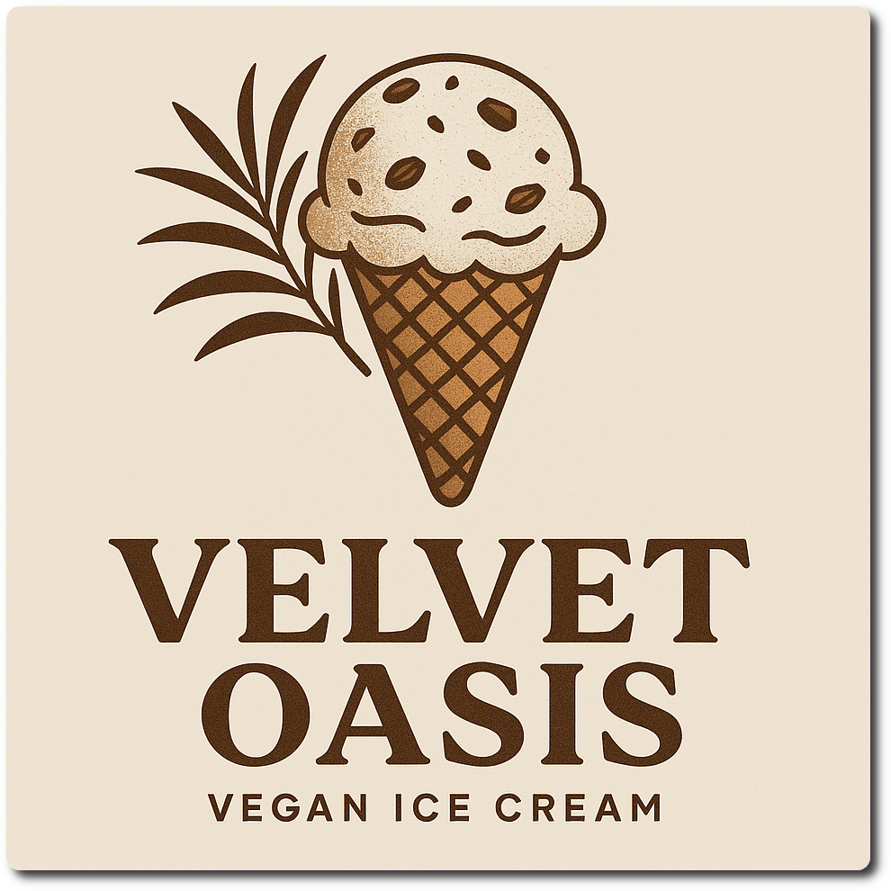

# Velvet Oasis (Deluxe)

Ice cream made with velvety nuts, sweetened with dates, and kissed by vanilla.

> 🌿 **Vegan & Dairy-free** Recipe is using only soy milk, dates, and nuts.

Processed on Sorbet, followed by a scrape-down and re-mix or respin.
Freeze again for about an hour to get to scoopable, if too soft for you.

> 

Rating: 😋🌴 (untested)

# INGREDIENTS

ℹ️ Brand names are in square brackets `[...]`.

**Prep**

  - _150ml_ Water (boiling)
  - _60g_ Medjool dates (pitted, organic) [Seba Garden] • 3 dates • distinctive caramel taste with hints of vanilla
  - _30g_ Cashew nuts (organic) [Biojoy]
  - _20g_ [Coconut flakes (desiccated) \[Biojoy\]](/ice-creamery/info/ingredients/#coconut-milk){target="_blank"}↗

**Wet**

  - _300ml_ [Soy milk 1.6% (sugar-free) \[Berief\]](/ice-creamery/info/ingredients/#soy-milk){target="_blank"}↗
  - _15g_ [Glycerin (E422, VG) \[hd-line\]](/ice-creamery/info/ingredients/#vegetable-glycerin-glycerol-vg-e422){target="_blank"}↗ • POD = 60%; GI = 5; Density = 1.26 g/ml
  - _10g_ [Brandy or Vodka 40 vol%](/ice-creamery/info/ingredients/#alcohol-ethanol){target="_blank"}↗

**Dry**

  - _25g_ [Xylitol (E967)](/ice-creamery/info/ingredients/#xylitol-e967){target="_blank"}↗ • POD = 100%; GI = 7
  - _15g_ ICSv2 [Erythritol / Inulin / CMC / Guar / XG / Salt] • [http﹕//bit.ly/4frc4Vj](https://jhermann.github.io/ice-creamery/I/Ice%20Cream%20Stabilizer%20(ICS)/)
  - _2g_ [Vanilla Bean Powder \[InterVanilla\]](/ice-creamery/info/ingredients/#cocoa-powder){target="_blank"}↗
  - _1g_ Salt

**Fill to MAX**

  - _92ml_ [Soy milk 1.6% (sugar-free) \[Berief\]](/ice-creamery/info/ingredients/#soy-milk){target="_blank"}↗ • make blending easier by splitting the milk
  - _0–7 drops_ Flavor drops Vanilla (sucralose) [IronMaxx] • to taste

# DIRECTIONS

 1. Cut the dates into halves by their long side, and make sure they’re pitted and not spoiled. Coarsely chop them into pieces.
 1. Soak the coconut flakes, cashews, and dates in the boiling water for at least 2 hours.
 1. Then blend everything to a smooth paste.
 1. Fill up with the ‘wet’ ingredients.
 1. Weigh and mix dry ingredients, easiest by adding to a jar with a secure lid and shaking vigorously.
 1. Pour into the tub and *QUICKLY* use an immersion blender on full speed to homogenize everything.
 1. Let blender run until thickeners are properly hydrated, up to 1-2 min. Or blend again after waiting that time.
 1. Add remaining ingredients (to the MAX line) and stir with a spoon.
 1. Put on the lid, freeze for 24h, then spin as usual. Flatten any humps before that.
 1. Process with RE-SPIN mode when not creamy enough after the first spin.

# NUTRITIONAL & OTHER INFO
- **Nutritional values per 100g/ml:** 100g; 106.4 kcal; fat 4.7g; carbs 15.1g; sugar 6.0g; protein 2.8g; salt 0.2g
- **Nutritional values per ½ Deluxe Tub:** 360g; 383.0 kcal; fat 16.7g; carbs 54.5g; sugar 21.7g; protein 10.2g; salt 0.8g
- **Nutritional values total:** 720g; 766.0 kcal; fat 33.5g; carbs 109.1g; sugar 43.4g; protein 20.3g; salt 1.6g
- **FPDF / [PAC](/ice-creamery/info/glossary/#potere-anti-congelante-pac){target="_blank"}↗ (target 20..30):** 30.25
- **Protein / Energy Ratio (ok=12%; hi=20%):** 10.60%
- **Milk Solids Non-Fat ([MSNF](/ice-creamery/info/glossary/#milk-solids-not-fat-msnf){target="_blank"}↗, 7-11%):** 0.0g • 0.0%
- **Net carbs:** 57.0g • *∝ 5 servings@144g:* 11.4g • *∝ 3 servings@240g:* 19g
- **15g Ice Cream Stabilizer (ICSv2) is:** 6.9g Erythritol (E968) • 6.9g Inulin • 0.69g Tylose powder (E466, Tylo, CMC) • 0.24g Guar gum (E412) • 0.24g Salt • 0.07g Xanthan gum (E415, XG).
