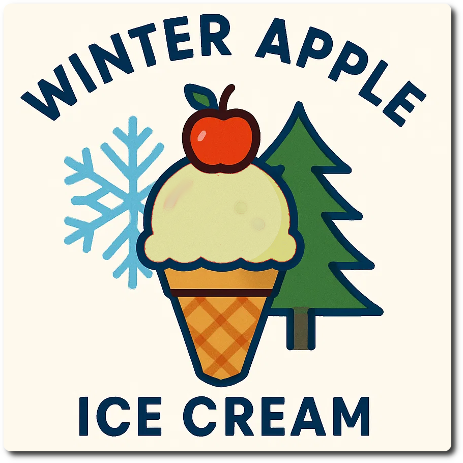
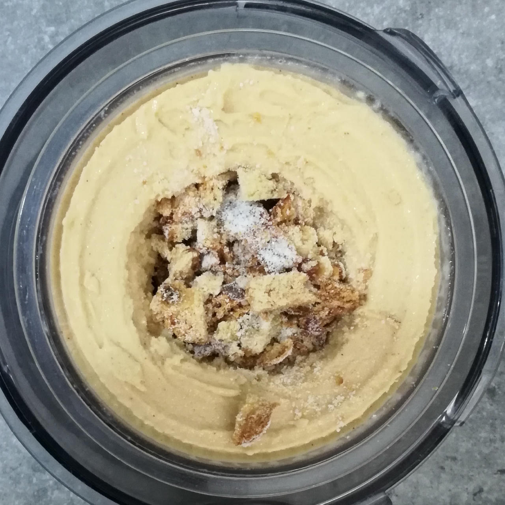

# Winter Apple (Deluxe)

Applesauce sherbet with cinnamon, and stollen pieces as a mix-in.

> 

Spun on Sorbet with a re-spin, and coarsely cubed stollen as a mix-in. The mix-in puts this squarely into delish territory.

> 

Rating: 😋😋🍎🍏🎅

# INGREDIENTS

ℹ️ Brand names are in square brackets `[...]`.

**Wet**

  - _300ml_ Apple Sauce (no added sugar) [Gut Bio/Aldi] • 1 jar = 355g
  - _150ml_ [Soy milk 1.6% (sugar-free) \[Berief\]](/ice-creamery/info/ingredients/#soy-milk){target="_blank"}↗
  - _100g_ [Cottage Cheese 4% \[REWE Bio\]](/ice-creamery/info/ingredients/#cottage-cheese){target="_blank"}↗
  - _15g_ [Glycerin (E422, VG) \[hd-line\]](/ice-creamery/info/ingredients/#vegetable-glycerin-glycerol-vg-e422){target="_blank"}↗ • Sweetness = 60%; GI = 5; Density = 1.26 g/ml
  - _10g_ [Brandy or Vodka 40 vol%](/ice-creamery/info/ingredients/#alcohol-ethanol){target="_blank"}↗

**Dry**

  - _32g_ [SweEX (Erythritol + Xylitol 3:2)](/ice-creamery/info/ingredients/#sweex-erythritol-xylitol-blend){target="_blank"}↗ • POD ≈ 90%; GI < 7
  - _15g_ [Salty Stability \[Inulin / GMS / CMC / Guar / XG / Salt\]](/ice-creamery/S/Salty%20Stability/){target="_blank"}↗ • unsweetened “ICSv2”
  - _3g_ Cinnamon (Ceylon) • 1tsp = 3g

**Fill to MAX**

  - _55ml_ [Soy milk 1.6% (sugar-free) \[Berief\]](/ice-creamery/info/ingredients/#soy-milk){target="_blank"}↗
  - _≈3 drops_ Flavor drops Vanilla (sucralose) [IronMaxx] • to taste
  - _≈3 drops_ Flavor drops Caramel (sucralose) [IronMaxx] • to taste

**Mix-ins**

  - _10g_ Raisins (chopped) • add as a topping or mix-in [30kcal, 6.8g sugar]

# DIRECTIONS

 1. Add "wet" ingredients to empty Creami tub.
 1. Weigh and mix dry ingredients, easiest by adding to a jar with a secure lid and shaking vigorously.
 1. Pour into the tub and *QUICKLY* use an immersion blender on full speed to homogenize everything.
 1. Let blender run until thickeners are properly hydrated, up to 1-2 min. Or blend again after waiting that time.
 1. Add remaining ingredients (to the MAX line) and stir with a spoon.
 1. Put on the lid, freeze for 24h, then spin as usual. Flatten any humps before that.
 1. Process with RE-SPIN mode when not creamy enough after the first spin.
 1. Process with MIX-IN after adding mix-ins evenly. For that, add partial amounts into a hole going down to the bottom, and fold the ice cream over, building pockets of mix-ins.

# NUTRITIONAL & OTHER INFO

- **Nutritional values per 100g/ml:** 100g; 69.4 kcal; fat 1.4g; carbs 14.6g; sugar 4.7g; protein 3.0g; salt 0.2g
- **Nutritional values per ½ Deluxe Tub:** 360g; 249.7 kcal; fat 4.9g; carbs 52.4g; sugar 16.9g; protein 10.8g; salt 0.7g
- **Nutritional values total:** 680g; 471.7 kcal; fat 9.3g; carbs 99.0g; sugar 31.9g; protein 20.4g; salt 1.4g
- **FPDF / [PAC](/ice-creamery/info/glossary/#potere-anti-congelante-pac){target="_blank"}↗ (target 20..30):** 30.47
- **Protein / Energy Ratio (ok=12%; hi=20%):** 17.30% • LOW-FAT • Low-Sugar
- **Milk Solids Non-Fat ([MSNF](/ice-creamery/info/glossary/#milk-solids-not-fat-msnf){target="_blank"}↗, 7-11%):** 24.2g • 3.6%
- **Net carbs:** 48.4g • *∝ 5 servings@136g:* 9.7g • *∝ 3 servings@227g:* 16.1g • *energy ratio (low <20%):* 41%
- **15g 'Salty Stability' is:** 11.0g Inulin • 1.8g Glycerol Monostearate (GMS / E471) • 0.9g Tylose powder (E466, Tylo, CMC) • 0.6g Guar gum (E412) • 0.5g Salt • 0.2g Xanthan gum (E415, XG).
