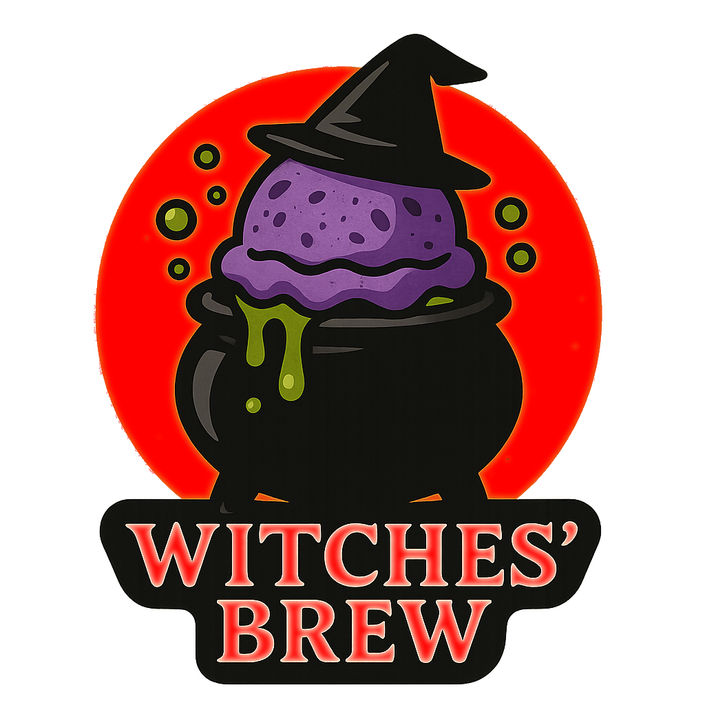

# Witches' Brew (Deluxe)

> *Take a scoop, if you dare!*

Halloween ice cream recipe inspired by themed cocktails & drinks.

On Halloween night, let “Witches’ Brew” cast its flavorful spell,
where cocktails and creamy ice cream become one beastly delight.

> 
> 
> 
> 
> *processing...* • Rating: 😋🧙‍♀️🪄🔥🎃 (details)

# INGREDIENTS

ℹ️ Brand names are in square brackets `[...]`.

**Prep**

  - _60g_ Gin 40 vol% (Spanish) [Larios]
  - _20ml_ Lime juice + zest (organic) [REWE Bio] • 1 lime = 60..65g
  - _10g_ Pomegranate syrup (nar ekşisi) [fersan] • 0.76 ml/g

**Wet**

  - _425ml_ [Soy milk 1.6% (sugar-free) \[Berief\]](/ice-creamery/info/ingredients/#soy-milk){target="_blank"}↗ • use any other preferred milk (~2% fat)
  - _10g_ Molasses [Grafschafter Goldsaft] • Sweetness = 66%

**Dry**

  - _25g_ [Inulin \[Vit4ever\]](/ice-creamery/info/ingredients/#inulin){target="_blank"}↗ • Sweetness = 8%; GI ~= 0
  - _25g_ [Isomalt (E953) \[GoodBake\]](/ice-creamery/info/ingredients/#isomalt-e953){target="_blank"}↗ • Very low GI, 50% sweetness
  - _25g_ Ube Yam Root powder [Fil Choice]
  - _10g_ [Whey + Casein protein (grass-fed) \[Vilgain\]](/ice-creamery/info/ingredients/#whey-protein){target="_blank"}↗ • with stevia
  - _10g_ [Waxy Maize Starch (E1442) \[Ultratex\]](/ice-creamery/info/ingredients/#waxy-maize-starch-e1442){target="_blank"}↗
  - _2.5g_ Beet Root Powder (organic) [Mandoi] • *optional*, for color
  - _0.75g_ Salt
  - _0.75g_ [Xanthan gum (E415, XG)](/ice-creamery/info/ingredients/#xanthan-gum-xg-e415){target="_blank"}↗ • ¼ tsp; *optional:* for better melting, and freezer stability

**Fill to MAX**

  - ❗*Prepared gin/lime/syrup mix* • Blend into base before tasting for sweetness
  - _50ml_ Cream 32% [REWE Beste Wahl] • Add and stir
  - _≈10 drops_ [Stevia drops “natural” \[Nick’s\]](/ice-creamery/info/ingredients/#stevia-e960){target="_blank"}↗ • to taste

**Mix-ins**

  - _15g_ Cranberries (sugared) [dm bio] • chopped [48kcal, 9g sugar]

# DIRECTIONS

 1. Zest and juice the lime, mix with syrup and alcohol.
 1. Add "wet" ingredients to empty Creami tub.
 1. Weigh and mix dry ingredients, easiest by adding to a jar with a secure lid and shaking vigorously.
 1. Pour into the tub and *QUICKLY* use an immersion blender on full speed to homogenize everything.
 1. Let blender run until thickeners are properly hydrated, up to 1-2 min. Or blend again after waiting that time.
 1. Add remaining ingredients (to the MAX line) and stir with a spoon.
 1. Put on the lid, freeze for 24h, then spin as usual. Flatten any humps before that.
 1. Process with RE-SPIN mode when not creamy enough after the first spin.
 1. Process with MIX-IN after adding mix-ins evenly. For that, add partial amounts into a hole going down to the bottom, and fold the ice cream over, building pockets of mix-ins.

# NUTRITIONAL & OTHER INFO

- **Nutritional values per 100g/ml:** 100g; 115.1 kcal; fat 3.5g; carbs 15.3g; sugar 3.0g; protein 3.6g; salt 0.2g
- **Nutritional values per ½ Deluxe Tub:** 340g; 391.4 kcal; fat 11.9g; carbs 52.2g; sugar 10.1g; protein 12.3g; salt 0.7g
- **Nutritional values total:** 674g; 776.0 kcal; fat 23.5g; carbs 103.4g; sugar 20.0g; protein 24.4g; salt 1.5g
- **FPDF / [PAC](/ice-creamery/info/glossary/#potere-anti-congelante-pac){target="_blank"}↗ (target 20..30):** 32.50
- **Protein / Energy Ratio (ok=12%; hi=20%):** 12.57% • Low-Sugar
- **Milk Solids Non-Fat ([MSNF](/ice-creamery/info/glossary/#milk-solids-not-fat-msnf){target="_blank"}↗, 7-11%):** 29.2g • 4.3%
- **Net carbs:** 68.6g • *∝ 5 servings@135g:* 13.7g • *∝ 3 servings@225g:* 22.9g • *energy ratio (low <20%):* 35.4%
