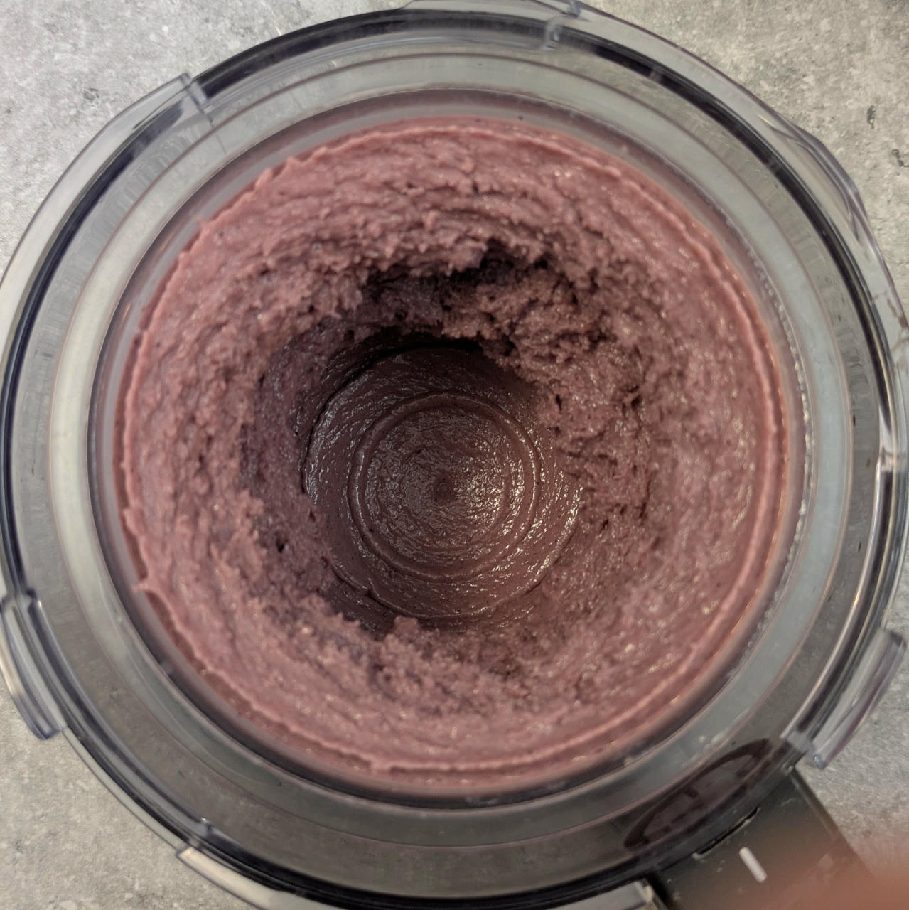
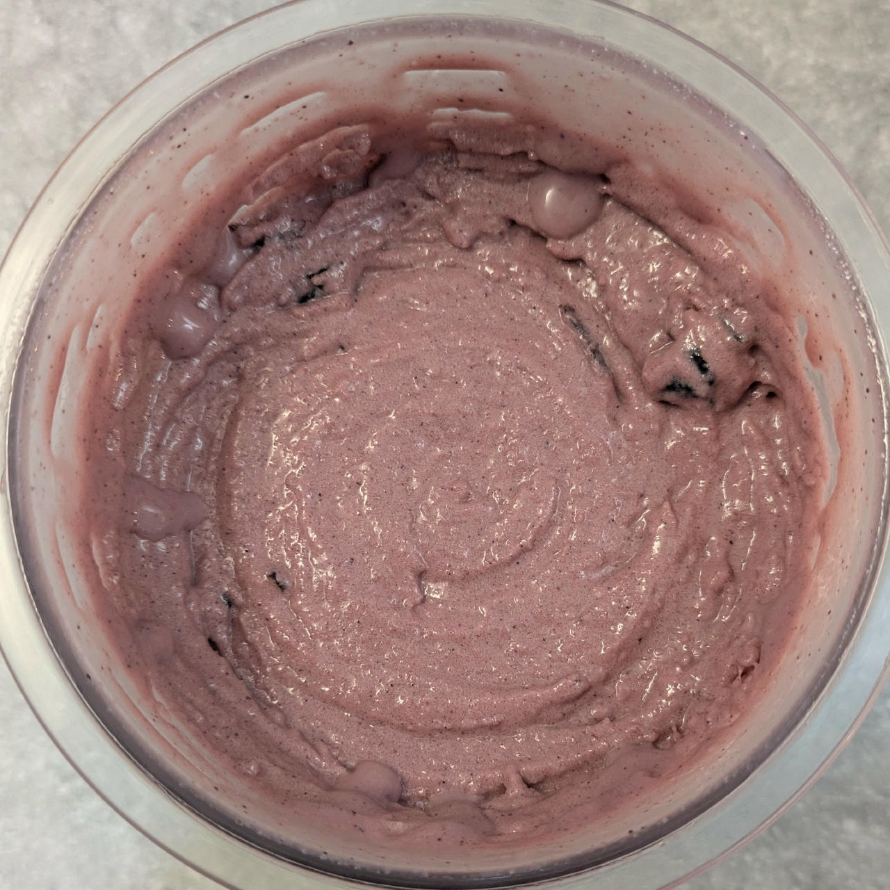
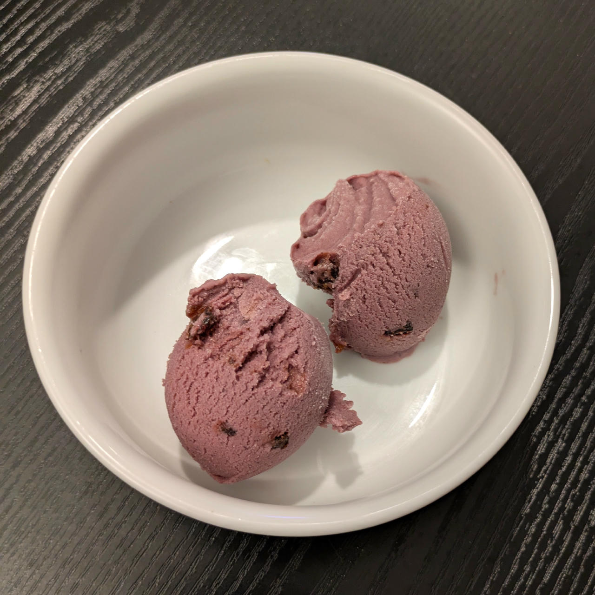

# Witches' Brew (Deluxe)

> *Take a scoop, if you dare!*

Halloween ice cream recipe inspired by themed cocktails & drinks.

On Halloween night, let “Witches’ Brew” cast its flavorful spell,
where cocktails and creamy ice cream become one beastly delight.

Spin on “Light Ice Cream”, scrape down, and run mix-in.
Mix-ins are not counted in the macros.

> 
> 
> 

> Rating: 😋🧙‍♀️🪄🎃 (still needs some work)

# INGREDIENTS

ℹ️ Brand names are in square brackets `[...]`.

**Prep**

  - _50g_ Grappa 40 vol% [Sibona]
  - _20ml_ Lime juice + zest (organic) [REWE Bio] • 1 lime = 60..65g
  - _17g_ Pomegranate syrup (nar ekşisi) [fersan] • 0.76 ml/g
  - _3ml_ Raspberry Emulsion [LorAnn] • 1 tbsp/l (1.5%)

**Wet**

  - _425ml_ [Soy milk 1.6% (sugar-free) \[Berief\]](/ice-creamery/info/ingredients/#soy-milk){target="_blank"}↗ • use any other preferred milk (~2% fat)
  - _10g_ Molasses [Grafschafter Goldsaft] • Sweetness = 66%

**Dry**

  - _30g_ [Trehalose \[SaporePuro\]](/ice-creamery/info/ingredients/#trehalose-e965){target="_blank"}↗ • *alternative:* 30g sugar, and less stevia
  - _15g_ [Inulin \[Vit4ever\]](/ice-creamery/info/ingredients/#inulin){target="_blank"}↗ • Sweetness = 8%; GI ~= 0
  - _15g_ Ube Yam Root powder [Fil Choice] • *alternative:* blueberry or lingonberry
  - _15g_ [Whey + Casein protein (grass-fed) \[Vilgain\]](/ice-creamery/info/ingredients/#whey-protein){target="_blank"}↗ • with stevia
  - _10g_ [Waxy Maize Starch (E1442) \[Ultratex\]](/ice-creamery/info/ingredients/#waxy-maize-starch-e1442){target="_blank"}↗
  - _3g_ Beet Root Powder (organic) [Mandoi] • *optional*, for color
  - _0.75g_ Salt
  - _0.75g_ [Xanthan gum (E415, XG)](/ice-creamery/info/ingredients/#xanthan-gum-xg-e415){target="_blank"}↗ • ¼ tsp; *optional:* for better melting, and freezer stability

**Fill to MAX**

  - [❗*Prepared alcohol/lime/syrup mix*](/ice-creamery/info/ingredients/#alcohol-ethanol){target="_blank"}↗ • Blend into base before tasting for sweetness
  - _60ml_ Cream 32% [REWE Beste Wahl] • Add and stir
  - _≈15 drops_ [Stevia drops “natural” \[Nick’s\]](/ice-creamery/info/ingredients/#stevia-e960){target="_blank"}↗ • to taste

**Mix-ins**

  - _20g_ Cranberries (sugared) [dm bio] • chopped & soaked [64kcal, 12g sugar]

# DIRECTIONS

 1. Chop the cranberries (mix-in), and soak them overnight in the fridge, covered in alcohol.
 1. Zest and juice the lime, mix with syrup and alcohol.
 1. Add "wet" ingredients to empty Creami tub.
 1. Weigh and mix dry ingredients, easiest by adding to a jar with a secure lid and shaking vigorously.
 1. Pour into the tub and *QUICKLY* use an immersion blender on full speed to homogenize everything.
 1. Let blender run until thickeners are properly hydrated, up to 1-2 min. Or blend again after waiting that time.
 1. Add remaining ingredients (to the MAX line) and stir with a spoon.
 1. Put on the lid, freeze for 24h, then spin as usual. Flatten any humps before that.
 1. Process with RE-SPIN mode when not creamy enough after the first spin.
 1. Process with MIX-IN after adding mix-ins evenly. For that, add partial amounts into a hole going down to the bottom, and fold the ice cream over, building pockets of mix-ins.

# NUTRITIONAL & OTHER INFO

- **Nutritional values per 100g/ml:** 100g; 121.4 kcal; fat 4.0g; carbs 14.0g; sugar 7.4g; protein 4.2g; salt 0.2g
- **Nutritional values per ½ Deluxe Tub:** 340g; 412.9 kcal; fat 13.6g; carbs 47.5g; sugar 25.3g; protein 14.2g; salt 0.8g
- **Nutritional values total:** 675g; 819.2 kcal; fat 26.9g; carbs 94.2g; sugar 50.1g; protein 28.2g; salt 1.5g
- **FPDF / [PAC](/ice-creamery/info/glossary/#potere-anti-congelante-pac){target="_blank"}↗ (target 20..30):** 31.50
- **Protein / Energy Ratio (ok=12%; hi=20%):** 13.75%
- **Milk Solids Non-Fat ([MSNF](/ice-creamery/info/glossary/#milk-solids-not-fat-msnf){target="_blank"}↗, 7-11%):** 34.4g • 5.1%
- **Net carbs:** 80.9g • *∝ 5 servings@135g:* 16.2g • *∝ 3 servings@225g:* 27g • *energy ratio (low <20%):* 39.5%
