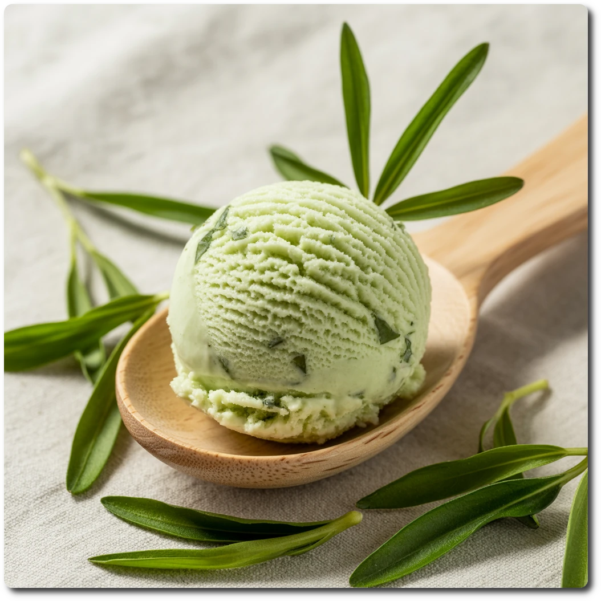

# Woodruff (Deluxe)

Woodruff flavor (or “Waldmeister”) is a rather German thing, used in the green version of *Berliner Kindl*,
in May punch (*Maibowle*), or as a flavor of *Ahoi Brause*.

This works using instant drink powder sticks for flavoring.
With this recipe, you can use any brand and flavor of instant drink powder you like though (e.g. IQMIX in the US),
as long as it is normally mixed into about 500ml of water.

The one I use is based on maltodextrin, and already contains a good amounts of sweetness,
so make sure to dial in any additional sweeteners to your palate.
While doing so, keep the freezing point depression in mind (more trehalose and less erythritol lowers both PAC and POD).

Spin on “Sorbet”, scrape down, and re-mix.
> 

Rating: 😋 (untested)

# INGREDIENTS

ℹ️ Brand names are in square brackets `[...]`.

**Wet**

  - _500ml_ [Soy milk 1.6% (sugar-free) \[Berief\]](/ice-creamery/info/ingredients/#soy-milk){target="_blank"}↗
  - _20g_ [Glycerin (E422, VG) \[hd-line\]](/ice-creamery/info/ingredients/#vegetable-glycerin-glycerol-vg-e422){target="_blank"}↗ • Sweetness = 60%; GI = 5; Density = 1.26 g/ml
  - _15g_ [Brandy or Vodka 40 vol%](/ice-creamery/info/ingredients/#alcohol-ethanol){target="_blank"}↗

**Dry**

  - _20g_ [Soy protein isolate (nature) \[Powerstar\]](/ice-creamery/info/ingredients/#soy-protein-isolate){target="_blank"}↗ • 1kg bag, unsweetened, unflavored
  - _20g_ [Whey + Casein protein (grass-fed) \[Vilgain\]](/ice-creamery/info/ingredients/#whey-protein){target="_blank"}↗ • with stevia
  - _20g_ [Trehalose \[SaporePuro\]](/ice-creamery/info/ingredients/#trehalose-e965){target="_blank"}↗ • POD = 45%; GI = 38
  - _15g_ [Erythritol (E968)](/ice-creamery/info/ingredients/#erythritol-e968){target="_blank"}↗ • POD = 75%
  - _15g_ [Salty Stability \[Inulin / GMS / CMC / Guar / XG / Salt\]](/ice-creamery/S/Salty%20Stability/){target="_blank"}↗ • unsweetened “ICSv2”
  - _2.5g_ Instant Drink “Woodruff” (0 sugar) [Instick] • 1 stick (2.5g) for 500ml water
  - _1g_ Matcha green tea powder (organic) [Mandoi] • for color; ½ tsp = 1g

**Fill to MAX**

  - _91.5ml_ Water (cold)
  - _≈1 drops_ Flavor drops Vanilla (sucralose) [IronMaxx] • to taste

# DIRECTIONS

 1. Add "wet" ingredients to empty Creami tub.
 1. Weigh and mix dry ingredients, easiest by adding to a jar with a secure lid and shaking vigorously.
 1. Pour into the tub and *QUICKLY* use an immersion blender on full speed to homogenize everything.
 1. Let blender run until thickeners are properly hydrated, up to 1-2 min. Or blend again after waiting that time.
 1. Add remaining ingredients (to the MAX line) and stir with a spoon.
 1. Put on the lid, freeze for 24h, then spin as usual. Flatten any humps before that.
 1. Process with RE-SPIN mode when not creamy enough after the first spin.

# NUTRITIONAL & OTHER INFO
- **Nutritional values per 100g/ml:** 100g; 76.6 kcal; fat 1.3g; carbs 10.4g; sugar 2.8g; protein 6.8g; salt 0.2g
- **Nutritional values per ½ Deluxe Tub:** 360g; 275.7 kcal; fat 4.9g; carbs 37.4g; sugar 10.0g; protein 24.6g; salt 0.8g
- **Nutritional values total:** 720g; 551.3 kcal; fat 9.7g; carbs 74.8g; sugar 20.0g; protein 49.3g; salt 1.5g
- **FPDF / [PAC](/ice-creamery/info/glossary/#potere-anti-congelante-pac){target="_blank"}↗ (target 20..30):** 27.03
- **Protein / Energy Ratio (ok=12%; hi=20%):** 35.77% • LOW-FAT • Low-Sugar • Hi-Protein
- **Milk Solids Non-Fat ([MSNF](/ice-creamery/info/glossary/#milk-solids-not-fat-msnf){target="_blank"}↗, 7-11%):** 56.7g • 7.9%
- **Net carbs:** 38.7g • *∝ 5 servings@144g:* 7.7g • *∝ 3 servings@240g:* 12.9g • *energy ratio (low <20%):* 28.1%
- **15g 'Salty Stability' is:** 11.0g Inulin • 1.8g Glycerol Monostearate (GMS / E471) • 0.9g Tylose powder (E466, Tylo, CMC) • 0.6g Guar gum (E412) • 0.5g Salt • 0.2g Xanthan gum (E415, XG).
